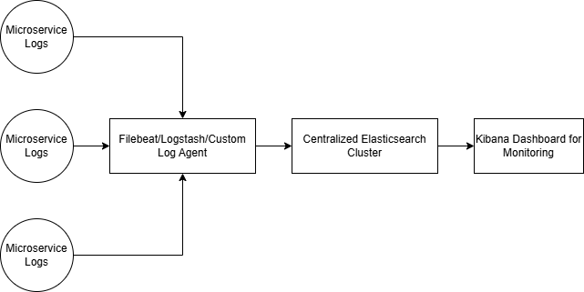

# Section 1: Engineering Mindset

#### Scenario-Based Question

**Problem:** Elasticsearch service is running out of memory.

---

### **Step-by-Step Troubleshooting Plan:**

1. **Analyze Elasticsearch Logs:**
   - Review Elasticsearch logs (`/var/log/elasticsearch/` or equivalent) to identify errors or warnings related to memory usage, such as frequent Garbage Collection (GC) pauses or OutOfMemory errors.

2. **Verify Cluster Health:**
   - Use `GET _cluster/health` or `GET _cat/health` to check the cluster status (green, yellow, or red).
   - Examine shard allocation with `GET _cat/shards` to detect imbalances.

3. **Check JVM Heap Usage:**
   - Use Elasticsearch’s monitoring APIs (`_nodes/stats/jvm`) or tools like Kibana or Prometheus to observe heap usage over time.
   - Identify whether heap pressure is consistently near the limit (e.g., > 75%).

4. **Examine Indexing/Query Workload:**
   - Use `_tasks` API to view resource-intensive tasks.
   - Check `_stats` for heavy indices or unusually large shards.

5. **Inspect Data Volume and Shard Design:**
   - Analyze indices and shard allocation using `_cat/indices` to ensure shard sizes are within the recommended range (10-50GB per shard).

6. **Verify Hardware Resources:**
   - Ensure sufficient CPU, RAM, and disk IOPS are available.
   - Confirm Elasticsearch is not swapping; disable it if necessary (`bootstrap.memory_lock: true` in `elasticsearch.yml`).

7. **Check Configuration Settings:**
   - Review JVM heap size in `jvm.options` (typically 50% of total RAM, up to a maximum of ~32GB).
   - Verify thread pool configurations for indexing and search.

8. **Monitor Data Retention Policy:**
   - Check the retention policy for logs and verify old indices are being rolled over or deleted to avoid data bloat.

---

### **Potential Optimizations:**

1. **Index and Shard Optimization:**
   - Merge smaller indices into fewer, larger ones.
   - Use the appropriate number of primary shards to balance indexing and search load.
   - Use the Rollover API for dynamic index lifecycle management.

2. **Resource Allocation:**
   - Scale vertically by increasing memory or horizontally by adding more nodes.
   - Use node roles (e.g., dedicated master, data, or ingest nodes) to optimize resource usage.

3. **Query and Index Caching:**
   - Enable query caching for frequently accessed data.
   - Optimize mappings and disable unnecessary fields like `_all`.

4. **Data Retention Policies:**
   - Apply Index Lifecycle Management (ILM) to automate deletion or archival of old indices.
   - Use `frozen` or `cold` tiers for less frequently accessed data.

5. **Heap and Garbage Collection Tuning:**
   - Adjust JVM heap size.
   - Monitor and optimize Garbage Collection settings.

6. **Use Elastic Monitoring Tools:**
   - Set up Elastic Stack monitoring in Kibana to gain better visibility into cluster performance.

---

#### Open-Ended Question

**Problem:** Design a logging and monitoring system for a new microservice integrated into an existing ELK stack.

---

### **Architecture Diagram:**

Below is a conceptual diagram for the logging system:

---

### **Written Explanation:**

1. **Log Generation:**
   - Ensure the microservice generates logs in a structured format (e.g., JSON) to make parsing easier.
   - Categorize logs by levels (INFO, WARN, ERROR) for better filtering.

2. **Log Forwarding:**
   - Deploy a lightweight agent like Filebeat in the microservice container to ship logs to Logstash or directly to Elasticsearch.
   - Configure Logstash pipelines to parse, enrich, and forward logs to Elasticsearch.

3. **Integration with Elasticsearch:**
   - Assign a unique index pattern (e.g., `service-name-*`) for the microservice logs to isolate them while maintaining compatibility with existing indices.
   - Use ILM policies to manage data retention for this service.

4. **Monitoring and Alerting:**
   - Add specific visualizations and dashboards in Kibana to monitor the microservice's performance and error rates.
   - Integrate with Elasticsearch Watcher or external tools like Prometheus/Alertmanager for real-time alerts on log anomalies.

5. **Scalability Considerations:**
   - Ensure sufficient resources in the Elasticsearch cluster to handle the additional logging load.
   - Configure proper rate limits in Filebeat/Logstash to prevent overloading Elasticsearch during peak traffic.

6. **Security and Access Control:**
   - Implement role-based access control (RBAC) in Elasticsearch/Kibana to restrict sensitive log access.
   - Mask or exclude sensitive data before ingesting logs.

This setup ensures the new microservice seamlessly integrates with the existing ELK stack while maintaining observability and scalability.

---

### **References**
- https://logz.io/learn/complete-guide-elk-stack