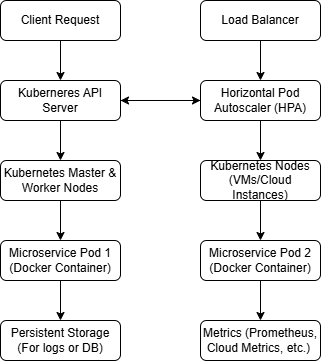

# Section 2: System Architecture

#### Design a Deployment Strategy for Autoscaling

For autoscaling a microservice running in Docker containers, I will propose a solution using **Kubernetes** for orchestration, combined with **Horizontal Pod Autoscaling (HPA)** for dynamic scaling, and utilizing **cloud provider services** (like AWS, GCP, or Azure) for managing resources.

##### Key Components of the Solution:
1. **Kubernetes Cluster**:
   - The service will run in a Kubernetes cluster, where containers are packaged and deployed as Pods.
   - Kubernetes manages the lifecycle of these Pods, handles autoscaling, and provides mechanisms for scaling based on metrics like CPU usage or request latency.

2. **Horizontal Pod Autoscaling (HPA)**:
   - The HPA will automatically scale the number of Pods running in response to observed CPU utilization or custom metrics (e.g., request rates, queue length).
   - The autoscaler ensures that the correct number of Pods are always running to meet the demand without over-provisioning resources.

3. **Load Balancer**:
   - Kubernetes services expose the application to the outside world via a load balancer (e.g., AWS ELB, GCP Load Balancer).
   - The load balancer distributes traffic across the available Pods, ensuring high availability and smooth traffic distribution.

4. **Cloud Provider (e.g., AWS/GCP/Azure)**:
   - The cloud provider can be used to handle scaling of the underlying virtual machines (VMs) or compute resources, which host the Kubernetes nodes.
   - Autoscaling at the VM level ensures that there are enough resources to support the Pods running on those nodes.

5. **Resource Requests and Limits**:
   - Containers will define resource requests (minimum required resources) and limits (maximum allowed resources) to ensure efficient use of cluster resources.
   - Kubernetes will ensure containers do not exceed resource limits and will intelligently allocate resources based on usage.

##### Deployment Strategy:
- **Step 1: Set up Kubernetes Cluster**: Deploy the microservice in a Kubernetes cluster with at least two nodes to ensure availability.
- **Step 2: Configure HPA**: Set the target metrics (e.g., CPU utilization 50%, or request rate > 100 requests/sec) that will trigger scaling.
- **Step 3: Configure Load Balancer**: Ensure that the load balancer is set to evenly distribute incoming traffic across the available Pods.
- **Step 4: Resource Requests and Limits**: Set appropriate resource limits to avoid wasting resources.
- **Step 5: Monitor and Adjust**: Continuously monitor autoscaling performance and adjust parameters like HPA thresholds and resource allocation based on traffic patterns.

##### Architecture Diagram:

Here’s an example architecture using Kubernetes for autoscaling:



---

### R&D and Reverse Engineering Task: Filebeat

#### How Filebeat Works

Filebeat is a lightweight log shipper for forwarding and centralizing log data. It is part of the **Elastic Stack** (ELK stack), designed to collect log data and forward it to destinations like **Elasticsearch**, **Logstash**, or a **Kafka cluster** for further processing.

##### Working of Filebeat:
1. **Log File Monitoring**:
   - Filebeat monitors log files in real-time using a configuration file (`filebeat.yml`) where paths to log files are defined.
   - Filebeat reads the log lines and forwards them to the defined output (e.g., Elasticsearch).

2. **Log Shipping**:
   - Once Filebeat reads the log data, it processes and forwards it. It can either send data directly to Elasticsearch or to Logstash (for additional processing).
   - The data is sent using HTTP or TCP protocols.

3. **Prospector/Harvesters**:
   - Each log file to be monitored is associated with a **prospector**.
   - Filebeat uses **harvesters** to read through the log files line by line.

4. **Backpressure Handling**:
   - Filebeat uses a buffer and backpressure system to manage situations where the output cannot handle the data at the rate it's being produced.

5. **Log Rotation**:
   - Filebeat is designed to handle log rotation gracefully. When files are rotated (renamed or archived), Filebeat automatically starts reading the new log files.

#### Proposed Improvement: Log Parsing and Enrichment

While Filebeat excels at shipping logs, it currently does not provide much in the way of log processing beyond simple parsing and forwarding. One potential improvement is **log enrichment**, which involves adding additional contextual information (such as environment variables, application state, or even geolocation based on IP addresses) before shipping logs.

##### Proposed Feature: Dynamic Log Enrichment with Contextual Data

**Feature Description**:  
Before sending logs to Elasticsearch or other destinations, enrich the log data with additional metadata, such as:
- Application environment (e.g., production, staging)
- Service name
- Geolocation of the IP addresses in logs
- Additional custom fields based on log content (e.g., user agent, API endpoint)

**Why it’s useful**:  
This would provide more context to the logs, improving the ability to filter, query, and visualize logs in Elasticsearch. It would also provide insights into where and how the application is being used, offering better monitoring and troubleshooting capabilities.

##### Implementation:

1. **Add Enrichment Process in Filebeat**:
   - Introduce a processor in Filebeat for dynamic enrichment. This processor can fetch data (e.g., from environment variables, external services, or IP geolocation APIs) and attach it to the logs before forwarding them.

2. **Pseudocode for Enrichment Processor**:
```yaml
processors:
  - add_fields:
      target: ""
      fields:
        environment: "${ENVIRONMENT}"
        service_name: "my-microservice"
  - geolocation:
      field: "client_ip"
      api_key: "your-api-key-for-geolocation"
  - add_fields:
      target: ""
      fields:
        timestamp: "${timestamp}"
```

3. **Integration**:
   - The new processor would be placed in the Filebeat configuration before the output step. It could dynamically fetch metadata and enrich the log entries.