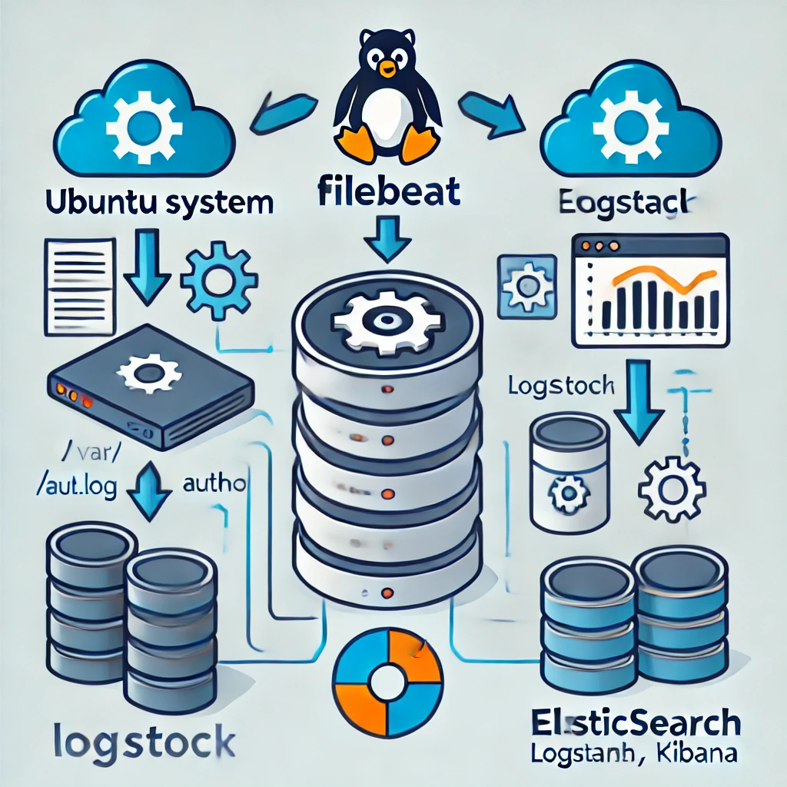
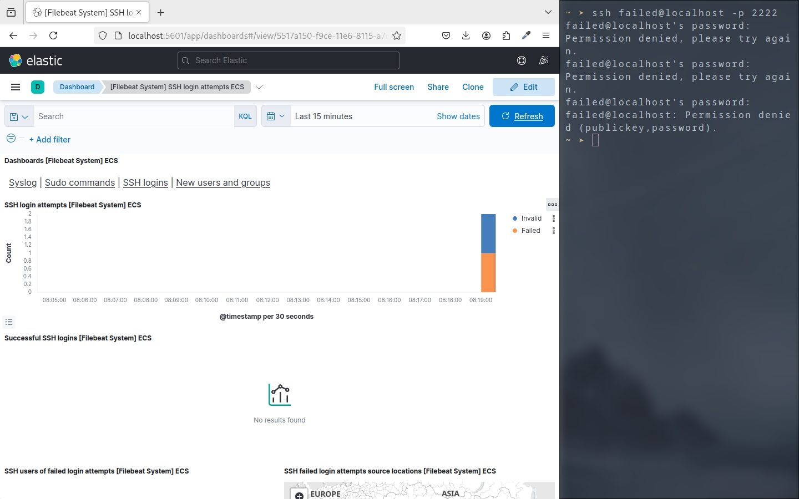
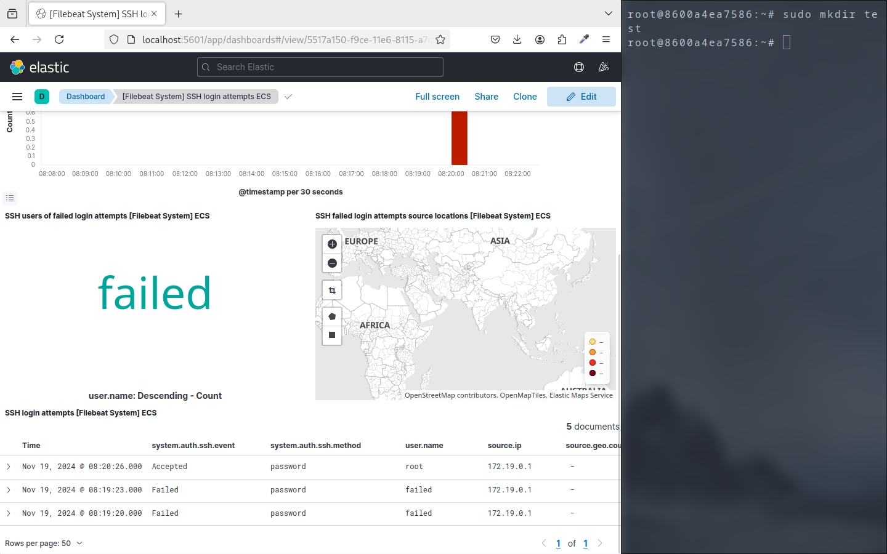
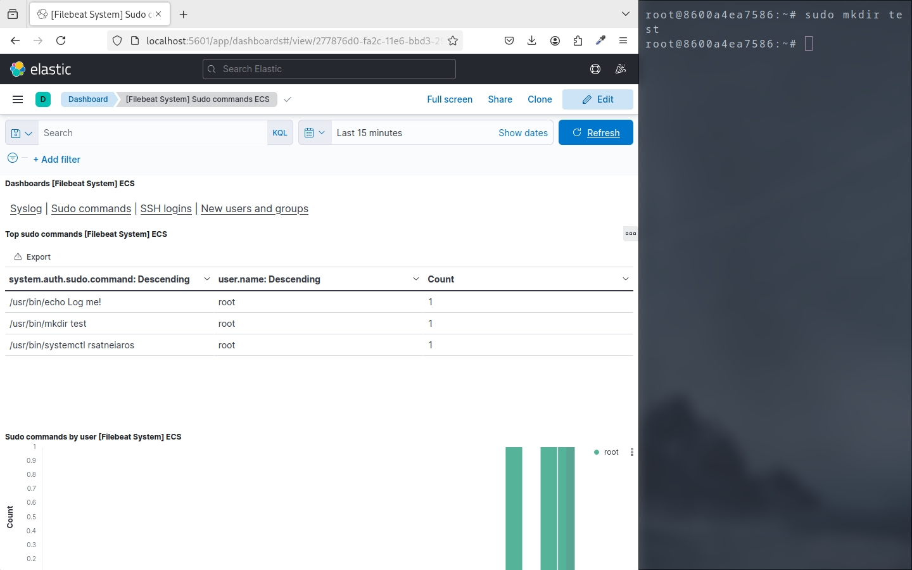
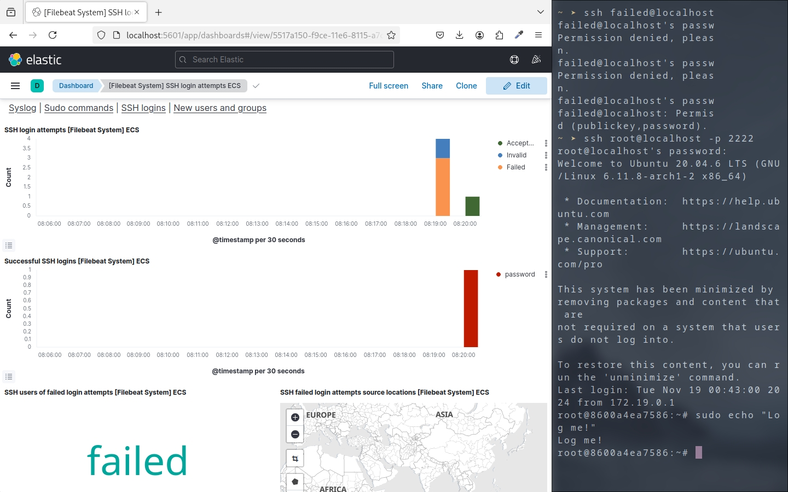

# Section 4: Security Task

This project demonstrates an ELK (Elasticsearch, Logstash, Kibana) stack with Filebeat to monitor and analyze logs. The setup is tailored to capture specific system activities and visualize them on a Kibana dashboard.

## Features

- **Capture executed commands**: Monitors commands executed on the system.
- **Detect failed SSH login attempts**: Tracks unsuccessful login attempts to identify potential security breaches.
- **Visualize results**: Displays logs and analytics on a Kibana dashboard.

## Getting Started

### Prerequisites

- Docker and Docker Compose installed.
- A Linux environment (e.g., Ubuntu 20.04+).
- Basic familiarity with Docker and ELK stack.

### Setup Instructions

1. **Go inside elk**:

   ```bash
   cd elk
   ```

2. **Build and run the stack**:

   - run

   ```bash
   docker-compose up -d
   ```

3. **Verify services**:

   - Access Kibana at `http://localhost:5601`.
   - Check Elasticsearch health: `http://localhost:9200/_cluster/health`.

4. **Setup filebeat & Generate sample data**:

   - after stack running, setup filebeat setup
     ```bash
     docker compose exec filebeat filebeat setup -e
     ```
   - Simulate failed SSH logins:
     ```bash
     ssh invalid_user@localhost -p 2222
     ```
     - Simulate success SSH logins:
     ```bash
     ssh root@localhost -p 2222 # password is `root`
     ```

5. **View logs in Kibana**:
   - Navigate to the pre-configured dashboard.

## Log Processing and Visualization

1. **Filebeat**:

   - Collects logs from configured sources (e.g., `/var/log/auth.log`).
   - Sends logs to Elasticsearch or Logstash.

2. **Elasticsearch**:

   - Stores the logs in a structured format.

3. **Kibana**:
   - Visualizes logs and provides insights via dashboards.



## What I Learned

- The relationship between **Filebeat** and the **ELK stack**.
- How to read logs from Ubuntu services using Filebeat and forward them to ELK.
- Troubleshooting logs that do not appear in Kibana, including addressing volume mismatches between Filebeat and the host system.

## What's next?

- security environment
- add more services!

## References

- [Deploy ELK with Docker Compose Including Filebeat](https://reza-mohammadi.medium.com/deploy-elk-with-docker-compose-including-filebeat-18e9c3aefb42)
- [GitHub: docker-elk by deviantony](https://github.com/deviantony/docker-elk)

## Screenshots and Examples





